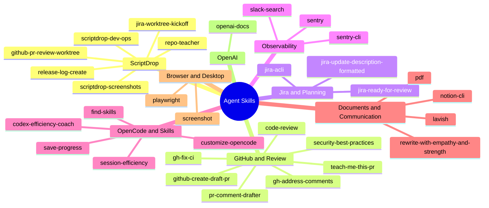

# Agent Skills Map

This is an inventory document, not a skill: its `SKILLS.md` filename prevents it from being auto-loaded as one. Keep it current whenever a skill is added, removed, renamed, or recategorized.

